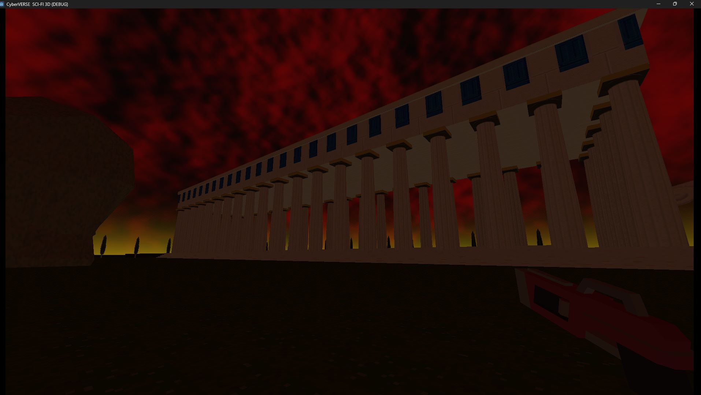
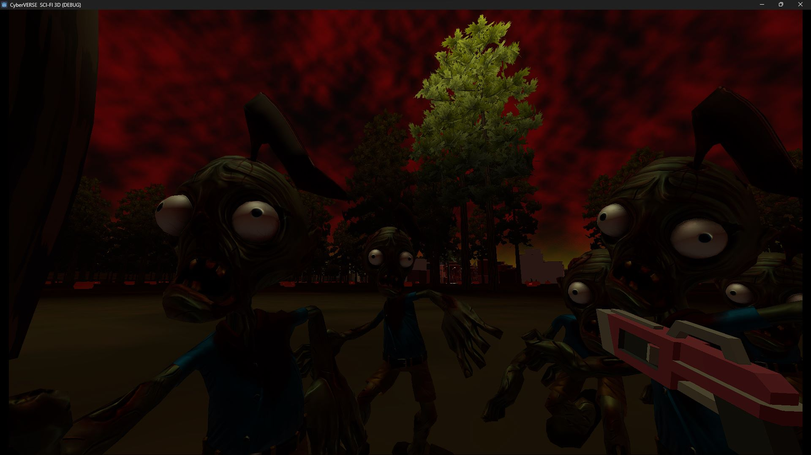
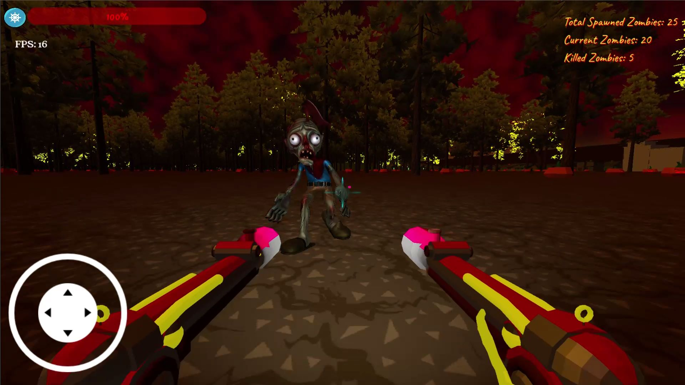

# Zombies Apocalypse 3D: The Resilient Saga of a 6-Month Odyssey 💪🎮

    

 

Greetings, intrepid explorer of the apocalypse! 🌌✨ Welcome to the immersive universe of **Zombies Apocalypse 3D**, a monumental journey that transcends the boundaries of game development. This six-month odyssey, fueled by passion and sleepless nights, has sculpted a game that is not merely a creation but a testament to unwavering dedication and relentless creativity.

## 🌟 Crafting Chaos and Mastering Creativity

 

**Zombies Apocalypse 3D** is not just a game; it's a symphony of chaos and creativity meticulously woven over six months of blood, sweat, and pixelated tears. Immerse yourself in an unparalleled gaming experience where each 3D model is a work of art, and every line of code tells a tale of resilience.

### 🚀 Key Features:

- **Visual Extravaganza:** Witness the apocalypse in all its glory with visually stunning 3D models that breathe life into the undead and environments, creating a mesmerizing dance of destruction.
  
  

 

- **Gameplay Revolution:** Unleash a barrage of endless bullets, navigate dynamic zombie spawns, and harness the strategic power of health regeneration. This isn't just a game; it's a revolution in gaming dynamics.
  
  

 

- **Coding Odyssey:** Traverse the challenging terrain of bugs, biases, and coding conundrums, emerging victorious with a polished masterpiece that stands as a beacon of code resilience.
  
  

 

## 🌌 Illuminating the Struggles

 

- **Visual Marvels:** Marvel at the culmination of sleepless nights as intricately crafted 3D models and awe-inspiring graphics breathe life into the apocalypse.

  

 

- **Mechanical Marvels:** Journey through the intricate mechanics that shape the game. Dive into the codebase, a battlefield where challenges transformed into triumphs, birthing an unparalleled gaming experience.

  

 

- **Code Resilience:** Peer behind the curtain and witness how struggles evolved into victories, turning obstacles into stepping stones on the path to perfection.

 

## 🚀 Launch into the Abyss

Embark on your immersive odyssey with these steps:

## 1. **Download the game only for PC 💻**    [Download ME 🤗 ⬇️📲](https://drive.google.com/file/d/1ldUp6EshSoRt-q3DbC7IneKfp0a4SY72/view?usp=drive_link)

 

2. **Ignite Godot:**
   - Uncover the secrets of the project in the Godot Engine.
   - Traverse scenes, scripts, and assets that echo the resilience of a project forged in the crucible of creativity.

3. **Unleash the Horde:**
   - Hit play in Godot and plunge into a world pulsating with the relentless onslaught of the undead.

## 🤝 Join the Battle

The apocalypse beckons, and your input is invaluable! Report bugs, suggest enhancements, or wield your coding prowess through pull requests. Let's evolve **Zombies Apocalypse 3D** into a dynamic masterpiece that reflects the collaborative spirit of the gaming community.

Survival has never been this exhilarating. Strap in, brave soul! 🔥💥🧟‍♂️

# The Symphony of Triumph: Unveiling the Saga of Zombies Apocalypse 3D  🌌💀

 

## 🌈 The Emotional Resilience

Peeling back the layers of development reveals not just lines of code but a tale of emotional resilience. The struggles were the emotional fuel that propelled the project forward.

### 🌊 Emotional Waves:

 

- **Dark Abyss of Doubt:** In the late nights, doubt often crept in like a shadow, questioning the very essence of the project. But each doubt was met with determination, illuminating the path forward.

- **Elation in Milestones:** Celebrate with me the emotional highs – from the first successful compilation to conquering a particularly elusive bug. Each victory became an emotional milestone on this tumultuous journey.

- **Community Echoes:** The emotional resonance of the community played a pivotal role. Your encouragement, feedback, and shared experiences became the emotional pillars that held this project aloft.

## 🎨 Artistry in Adversity

 

Witness the emotional artistry that emerged from adversity. Every struggle, bug, and sleepless night became brushstrokes on the canvas of **Zombies Apocalypse 3D**.

### 🎭 Masterpieces of Emotion:

 

- **Code as Poetry:** Transcend the binary realm; the code became poetry, expressing frustration, joy, and determination. Each line bore the emotional fingerprint of the creator.

- **Visual Emotions:** The graphics and 3D models are not mere visuals; they are emotional landscapes, crafted with the passion to evoke a myriad of emotions from the player.

- **Innovative Heartbeats:** Every game mechanic resonates with emotion. The unlimited bullets echo the relentless spirit, while health regeneration becomes a heartbeat, pulsating with strategic emotion.

## 💔 Heartbreaks and Healing

Through the emotional journey, heartbreaks were inevitable. Bugs seemed insurmountable, and biases felt like emotional scars. Yet, in the face of adversity, the healing power of creativity emerged.

### 🌟 Emotional Healing:

- **Bug's Sting:** The sting of a bug was not just a technical glitch; it was an emotional wound. Yet, with each bug fix, the healing process unfolded, turning wounds into scars that told a story of growth.

- **Biases as Challenges:** Biases were emotional obstacles, but overcoming them became a journey of self-discovery and a testament to the unyielding spirit that fuels creation.

- **Sleepless Redemption:** The sacrifice of sleep was not just a physical toll; it was an emotional investment in the dream of perfection. Sleepless nights were redeemed with every polished feature.

## 🚀 Beyond the Apocalypse

As you venture into the heart of **Zombies Apocalypse 3D**, remember that what you experience is not just a game. It's an emotional symphony, a manifestation of dreams, struggles, and triumphs. Every zombie slayed, every bullet fired, and every victory celebrated resonates with the emotional journey that birthed this apocalypse.

## 🤝 Join the Emotional Movement

Become part of the emotional movement! Share your struggles, triumphs, and emotions. **Zombies Apocalypse 3D** is not just a solo journey; it's an emotional collective waiting for your voice.

## 📝 License for Emotional Legacy

This project carries an emotional legacy, a story that transcends lines of code. Explore and contribute to the emotional journey, licensed under the [MIT License](LICENSE). It's an invitation to add your emotional signature to this living masterpiece.

---

Embark on the emotional odyssey, where every click, every line, and every pixel resonates with the heartbeat of creation. 🌟💖🎮
